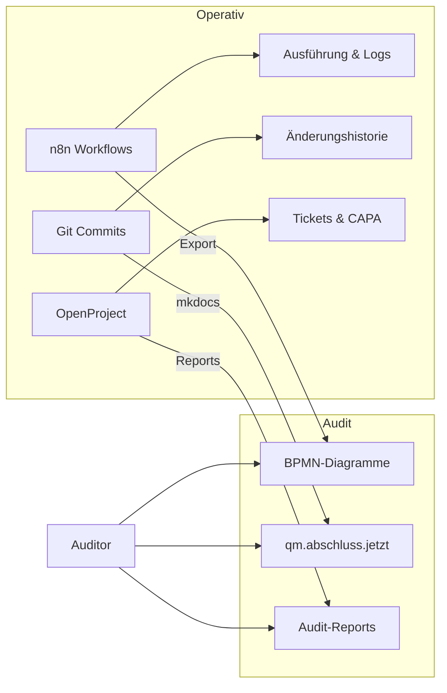

# Prozessmodellierung — Framework-Entscheidung

## Entscheidung

Wir arbeiten nach **FitSM** (Federated IT Service Management) und verwenden ergänzend **ITIL-v4-Terminologie**, wo sie allgemein bekannt und für Auditoren verständlich ist.

## Begründung

| Kriterium | FitSM | Warum das passt |
| --- | --- | --- |
| **Lizenz** | Creative Commons — kostenlos | Kein Budget für proprietäre Frameworks |
| **Umfang** | 14 Prozesse (vs. ITIL 34) | Passend für 1-5 Personen in der Gründungsphase |
| **Templates** | FitSM-4: SLA, Policies, Prozesse — frei | Sofort nutzbar ohne Eigenentwicklung |
| **Maturity-Model** | FitSM-6: Stufenweise Reifebewertung | Wachstum über 5-7 Jahre abbildbar |
| **ISO-20000-Pfad** | Explizit als Einstieg konzipiert | Langfristige Professionalisierung möglich |
| **Bildungsfokus** | Für Bildung und Forschung entwickelt | Passt kulturell zu einem Bildungsträger |

### Warum zusätzlich ITIL-Vokabular?

ITIL ist der De-facto-Standard — Auditoren, Partner und Fördermittelgeber kennen Begriffe wie "Incident Management", "Change Management", "Service Level Agreement". Wir nutzen dieses Vokabular in unserer Dokumentation, damit Externe sofort verstehen, wovon wir sprechen.

### Bewertete Alternativen

| Framework | Ergebnis | Grund |
| --- | --- | --- |
| **ITIL v4** | Ergänzend (Vokabular) | 34 Practices überdimensioniert; offizielle Zertifizierung teuer (ab 680 EUR) |
| **USM** | Geeignet, aber weniger Material | Frei und einfach, aber kleinere Community und weniger Templates als FitSM |
| **VeriSM** | Nicht geeignet | Proprietär, zu abstrakt, keine konkreten Templates |
| **ISM** | Nicht geeignet | Proprietär, sehr kleine Community, kaum freie Ressourcen |
| **IT4IT** | Nicht geeignet | Enterprise-fokussiert, teuer, irrelevant für Bildungsträger |
| **COBIT** | Nicht geeignet | Governance-Framework, falscher Fokus |
| **ISO 20000** | Langfristziel | Organisationszertifizierung ab 10.000 EUR — erst bei Wachstum relevant |

Detaillierter Vergleich aller 8 Frameworks: [Report: ITSM-Frameworks — Vergleich & Empfehlung](../reports/itsm-framework-vergleich.md)

---

## Ausgewählte FitSM-Prozesse

Aus den 14 FitSM-Prozessen sind für uns derzeit **8 relevant**. Die übrigen werden bei Bedarf aktiviert.

| FitSM-Prozess | ITIL-Äquivalent | Unsere Umsetzung | Werkzeug |
| --- | --- | --- | --- |
| **SPM** — Service Portfolio Management | Service Catalogue Mgmt | Kursangebot-Katalog, Maßnahmenbeschreibungen | BookStack |
| **SLM** — Service Level Management | Service Level Mgmt | Qualitätsziele, Betreuungsverhältnis, KPIs | OpenProject |
| **ISM** — Incident & Service Request Mgmt | Incident Management | Beschwerden, Teilnehmer-Anfragen | OpenProject |
| **CHM** — Change Management | Change Enablement | Änderungen an Kursen, Plattform, Prozessen | Git + OpenProject |
| **CONFM** — Configuration Management | Service Configuration Mgmt | Infrastruktur-Dokumentation, CMDB | Git + Ansible |
| **CSI** — Continual Service Improvement | Continual Improvement | KVP, CAPA, interne Audits, Management-Reviews | OpenProject + n8n |
| **ISRM** — Information Security Mgmt | Information Security Mgmt | Rollen, Zugangsrechte, Datenschutz | Keycloak + Docs |
| **SUPPM** — Supplier Management | Supplier Management | Partner- und Sponsoren-Verwaltung | CiviCRM |

### Noch nicht aktivierte Prozesse

| FitSM-Prozess | Aktivierung geplant |
| --- | --- |
| Availability & Capacity Management | Bei Wachstum (>50 TN gleichzeitig) |
| Problem Management | Nach 2. AZAV-Rezertifizierung |
| Release & Deployment Management | Wenn CI/CD-Pipelines komplexer werden |
| Financial Management | Bei hauptamtlichem Personal |
| Customer Relationship Management | Bei >3 Unternehmenskunden |
| Reporting Management | Bei regelmäßigem Berichtswesen an Fördermittelgeber |

---

## Maturity-Roadmap (FitSM-6)

FitSM-6 definiert 5 Reifegradstufen pro Prozess. Unsere Ziele:

| Phase | Zeitraum | Ziel-Level | Beschreibung |
| --- | --- | --- | --- |
| **Gründung** | 2026 (Jahr 0-1) | Level 1-2 | Prozesse existieren und sind grundlegend dokumentiert |
| **AZAV-Zertifizierung** | 2026-2027 (Jahr 1-2) | Level 2-3 | Prozesse sind implementiert, gemessen und auditfähig |
| **Wachstum** | 2027-2030 (Jahr 2-5) | Level 3-4 | Prozesse sind etabliert, KPIs werden systematisch erhoben |
| **Reife** | 2030+ (Jahr 5-7) | Level 4-5 | Prozesse sind optimiert, ggf. ISO-20000-Migration |

### Self-Assessment-Rhythmus

- **Jährlich:** Vollständiges FitSM-6 Self-Assessment aller aktiven Prozesse
- **Halbjährlich:** Fokus-Assessment der AZAV-kritischen Prozesse
- **Ergebnisse:** Dokumentiert in OpenProject, Teil des Management-Reviews

---

## Prinzip: Prozesse in Code, nicht nur auf Papier

Wir implementieren Prozesse als **ausführbare Workflows** — die Automatisierung IST die Dokumentation.

### Duale Darstellung

| Für wen | Was | Wo |
| --- | --- | --- |
| **Betrieb** | Laufende Workflows, Tickets, Git-History | n8n, OpenProject, Git |
| **Auditor** | Prozessbeschreibungen, Diagramme, KPIs | qm.abschluss.jetzt (Keycloak-Zugang) |
| **Beide** | Änderungshistorie, Audit-Trail | Git log, OpenProject Activity |

### Warum das funktioniert

- **Git = Audit-Trail:** Wer hat was wann geändert (git log, git blame)
- **n8n = lebende Prozessdoku:** Jeder Node ist ein Prozessschritt, jede Ausführung ein Nachweis
- **OpenProject = CAPA:** Korrekturmaßnahmen sind Tickets mit Fristen und Verantwortlichen
- **mkdocs = Auditor-Frontend:** Automatisch aus Markdown generiert, lesbar ohne technisches Wissen

---

## Lernressourcen (kostenlos)

| Ressource | URL | Inhalt |
| --- | --- | --- |
| **FitSM Standard** | fitsm.eu | Alle 6 Teile (FitSM-0 bis FitSM-6) als PDF |
| **FitSM Online-Kurs** | fitsm.online | Selbstlernkurs mit Videos und Übungsfragen |
| **FitSM Schulungsfolien** | fitsm.eu (Downloads) | Offizielle Präsentationen für alle Levels |
| **YaSM Wiki** | yasm.com/wiki | Detaillierte Erklärungen aller ITSM-Prozesse |
| **ITIL YouTube** | diverse Kanäle | Foundation-Kurse komplett kostenlos |
| **ITIL Cheatsheets** | purplegriffon.com, cheatography.com | Zusammenfassungen aller 34 Practices |

---

## Quellen

- FitSM Standard: [fitsm.eu](https://www.fitsm.eu/)
- FitSM-6 Maturity Model: [fitsm.eu/fitsm-standard](https://www.fitsm.eu/fitsm-standard/)
- ITIL v4 Foundation: PeopleCert / Axelos
- [Prozesse](prozesse.md) — Unsere 6 Kernprozesse mit FitSM-Mapping
- [Übersicht](uebersicht.md) — AZAV-Anforderungen und QM-Rahmen
