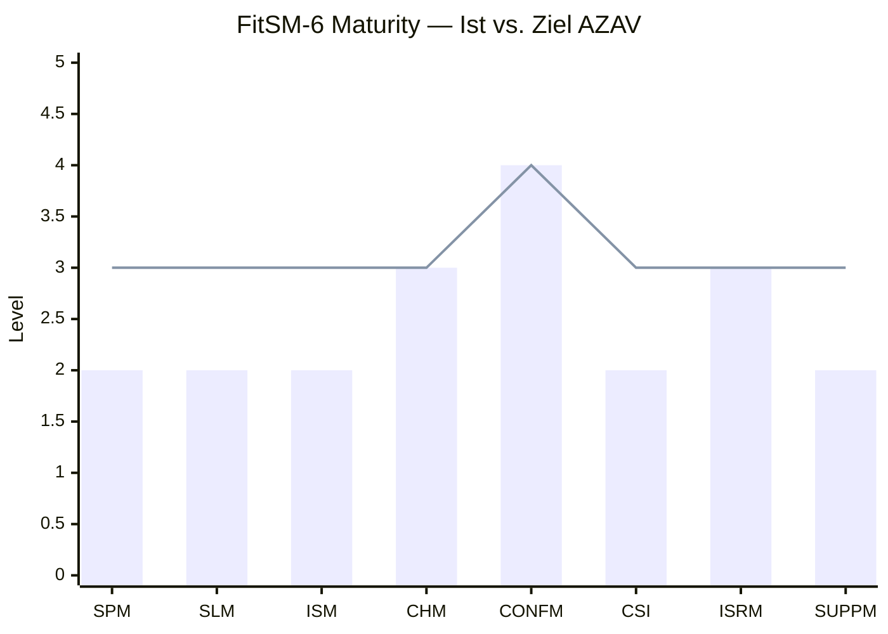

# FitSM-6 Self-Assessment

> Stand: 2026-03-31 | Nächste Bewertung: Q3 2026 (vor AZAV-Antrag)

## Bewertungsskala (FitSM-6)

| Level | Beschreibung |
| --- | --- |
| **0** | Nicht existent |
| **1** | Initial: Prozess existiert ad-hoc, nicht dokumentiert |
| **2** | Geplant: Prozess dokumentiert, Werkzeuge bereit, teilweise umgesetzt |
| **3** | Implementiert: Prozess läuft, wird gemessen, Ergebnisse nachweisbar |
| **4** | Etabliert: Prozess ist stabil, KPIs werden systematisch erhoben und ausgewertet |
| **5** | Optimiert: Prozess wird kontinuierlich verbessert auf Basis von Messdaten |

## Ergebnis

| Prozess | Ist | Ziel AZAV | Gap | Priorität |
| --- | --- | --- | --- | --- |
| **SPM** — Service Portfolio | 2 | 3 | 1 | Mittel |
| **SLM** — Service Level Mgmt | 2 | 3 | 1 | Hoch |
| **ISM** — Incident Mgmt | 2 | 3 | 1 | Hoch |
| **CHM** — Change Mgmt | 3 | 3 | 0 | -- |
| **CONFM** — Config Mgmt | 4 | 4 | 0 | -- |
| **CSI** — Continual Improvement | 2 | 3 | 1 | Kritisch |
| **ISRM** — Info Security | 3 | 3 | 0 | -- |
| **SUPPM** — Supplier Mgmt | 2 | 3 | 1 | Niedrig |
| **Durchschnitt** | **2.5** | **3.1** | | |

## Detailbewertung

### SPM — Service Portfolio Management (Level 2)

**Was existiert:**

- BookStack (wiki.abschluss.jetzt) ist deployt und live
- CiviCRM verwaltet Teilnehmer und Volunteers
- Keycloak-Kohortensystem trackt Einschreibungen (`/edu/260601`)
- Kursangebot in QM-Handbuch Sektion 06 und `docs/aussenkommunikation/lehrplan-und-angebot.md` beschrieben

**Was fehlt für Level 3:**

- [ ] Formaler Service-Katalog in BookStack: Jedes Angebot (Nachhilfe, Intensivkurs, Mentoring, Projektbetreuung) als eigene Seite mit Zielgruppe, Umfang, Voraussetzungen, Kapazität
- [ ] Verknüpfung Service-Katalog ↔ CiviCRM (welche Teilnehmer sind in welchem Service eingeschrieben)

**Aufwand:** ~4h (BookStack-Seiten anlegen, Struktur aus Lehrplan übernehmen)

---

### SLM — Service Level Management (Level 2)

**Was existiert:**

- KPIs definiert im QM-Handbuch (Bestehensquote ≥80%, Zufriedenheit ≥4.0, Abbruch ≤15%, Integration ≥70%)
- OpenProject deployt für Tracking
- n8n-Infrastruktur bereit für Automatisierung

**Was fehlt für Level 3:**

- [ ] KPI-Dashboard in OpenProject einrichten (ein Projekt "QM-Kennzahlen" mit Custom Fields pro Kohorte)
- [ ] Erste Messung durchführen: Bestehensquote der Kohorte 260201 (AP1 Feb 2026) erfassen
- [ ] Feedback-Formular in Nextcloud Forms erstellen und nach nächster Prüfungsphase einsetzen
- [ ] n8n-Workflow: Automatische Erinnerung an Feedback-Erhebung 1 Woche nach Prüfung

**Aufwand:** ~8h (Dashboard Setup, Formular, erster n8n-Workflow)

---

### ISM — Incident & Service Request Management (Level 2)

**Was existiert:**

- OpenProject-Ticketsystem deployt
- Beschwerdeprozess im QM-Handbuch dokumentiert (6 Schritte)
- Formular F-04 (Beschwerde) definiert

**Was fehlt für Level 3:**

- [ ] OpenProject-Projekt "Beschwerden & Anfragen" anlegen mit Ticket-Template
- [ ] Beschwerde-Formular auf Website oder als Nextcloud-Form bereitstellen (niedrigschwellig, auch für TN ohne OpenProject-Zugang)
- [ ] n8n-Workflow: Formular-Eingang → automatisches OpenProject-Ticket + Benachrichtigung an Verantwortlichen
- [ ] Erste Test-Beschwerde durchspielen und dokumentieren (Audit-Evidence)

**Aufwand:** ~6h (Projekt anlegen, Formular, n8n-Workflow, Test)

---

### CHM — Change Management (Level 3) ✓

**Was existiert:**

- Forgejo (Git) mit vollständiger Commit-History
- Pull-Request-Workflow für Änderungen
- 9 ADRs dokumentiert (Architekturentscheidungen)
- Ansible als Change-Execution-Mechanismus (Infrastructure as Code)
- Alle Infrastrukturänderungen sind Code-Änderungen → automatischer Audit-Trail

**Was fehlt für Level 4:**

- [ ] Formale Change-Approval-Dokumentation (wer genehmigt welche Änderungskategorie)
- [ ] Kategorisierung: Standard-Changes (z.B. Content-Update) vs. Significant Changes (z.B. neuer Service)

**Status:** Erfüllt Ziel-Level für AZAV. Level 4 ist Nice-to-have.

---

### CONFM — Configuration Management (Level 4) ✓

**Was existiert:**

- 30+ Ansible-Rollen (vollständige Infrastruktur als Code)
- 9 LXC-Container mit definierter Ressourcenallokation
- Git-basierte Versionierung aller Konfigurationen
- Keycloak-Config-Rolle (programmatische Realm/Gruppen/Client-Erstellung)
- Netzwerk-, Firewall- und SSL-Konfiguration dokumentiert und automatisiert

**Warum Level 4:**

Ansible + Git IST die CMDB. Jede Konfigurationsänderung ist ein Commit mit Autor, Zeitstempel und Diff. Reproduzierbar, auditierbar, rollback-fähig.

**Status:** Übertrifft Ziel-Level. Kein Handlungsbedarf.

---

### CSI — Continual Service Improvement (Level 2) ⚠ KRITISCH

**Was existiert:**

- CSI-Framework vollständig dokumentiert (Audits, Management-Reviews, CAPA, Lessons Learned)
- OpenProject für Audit-Tracking und CAPA deployt
- n8n für Automatisierung bereit
- Formulare definiert (F-05 Audit-Checkliste, F-06 Management-Review, F-07 CAPA)

**Was fehlt für Level 3 (AZAV-kritisch):**

- [ ] **Ersten internen Audit durchführen** — Audit-Checkliste (F-05) in OpenProject als Projekt anlegen, 2-3 Prozesse prüfen, Findings dokumentieren
- [ ] **Erstes Management-Review** — Quartalsprotokoll (F-06) erstellen: Was läuft, was nicht, welche Massnahmen
- [ ] **CAPA-Zyklus starten** — Mindestens 1 Finding aus dem Audit als CAPA-Ticket in OpenProject erfassen, bearbeiten, Wirksamkeit prüfen
- [ ] **n8n: Audit-Reminder-Workflow** — Automatische Erinnerung an nächsten Audit-Termin
- [ ] **Lessons Learned** — Nach der nächsten Prüfungsphase strukturiert erfassen

**Warum kritisch:** Der Auditor wird fragen: "Zeigen Sie mir Ihren letzten Auditbericht und eine abgeschlossene CAPA." Ohne diesen Nachweis keine Zertifizierung.

**Aufwand:** ~12h (erster Audit-Zyklus + Management-Review + 1 CAPA abschliessen)

---

### ISRM — Information Security Management (Level 3) ✓

**Was existiert:**

- Keycloak SSO mit Gruppenhierarchie und OIDC für alle Services
- Vaultwarden (Passwort-Manager) deployt
- TLS/SSL auf allen Services (Wildcard + individuelle Zertifikate)
- UFW-Firewall + iptables NAT konfiguriert
- Headscale VPN für Administration
- SSH Key-based Access
- Informationsklassifikation dokumentiert (Öffentlich → Streng vertraulich)
- Zugangsmatrix (wer darf was) dokumentiert und in Keycloak umgesetzt

**Was fehlt für Level 4:**

- [ ] DSGVO-Incident-Response-Verfahren finalisieren (Art. 33/34 — im QM-Handbuch als TODO markiert)
- [ ] CiviCRM SSO-Integration (steht als "Pending")
- [ ] Security-Awareness-Schulung für Dozenten/Volunteers dokumentieren

**Status:** Erfüllt Ziel-Level für AZAV. DSGVO-Verfahren sollte vor Audit finalisiert werden.

---

### SUPPM — Supplier Management (Level 2)

**Was existiert:**

- CiviCRM deployt für Volunteer-, Spenden- und Mitglieder-Management
- Partner-Liste dokumentiert (VR-Nutzergemeinschaft, BeLUG, IN-Berlin, berlinCreators)
- Sponsoring-Pakete konzipiert (Bronze/Silber/Gold)

**Was fehlt für Level 3:**

- [ ] Partner in CiviCRM erfassen (Kontaktdaten, Vereinbarung, Leistung, Status)
- [ ] Mautic ↔ CiviCRM Sync via n8n (Lead-Konvertierung)
- [ ] Ehrenamtsvereinbarung (F-09) und Vertraulichkeitsvereinbarung (F-10) aktiv nutzen

**Aufwand:** ~4h (CiviCRM-Daten pflegen, Vereinbarungen vorbereiten)

---

## Zusammenfassung: Was muss vor dem AZAV-Audit passieren?

### Kritischer Pfad (ohne das keine Zertifizierung)

| # | Massnahme | Prozess | Aufwand | Ziel |
| --- | --- | --- | --- | --- |
| 1 | **Ersten internen Audit durchführen** | CSI | 4h | Audit-Finding + Bericht |
| 2 | **Erstes Management-Review** | CSI | 2h | Quartalsprotokoll |
| 3 | **Mindestens 1 CAPA abschliessen** | CSI | 4h | Problem → Massnahme → Wirksamkeit |
| 4 | **KPI-Messung erste Kohorte** | SLM | 2h | Bestehensquote, Feedback |
| 5 | **Beschwerdeprozess testen** | ISM | 2h | Ein Ticket end-to-end |

**Gesamtaufwand kritischer Pfad: ~14h**

### Empfohlen (stärkt die Position im Audit)

| # | Massnahme | Prozess | Aufwand |
| --- | --- | --- | --- |
| 6 | Service-Katalog in BookStack | SPM | 4h |
| 7 | DSGVO-Incident-Response finalisieren | ISRM | 2h |
| 8 | Partner in CiviCRM pflegen | SUPPM | 4h |
| 9 | n8n-Workflows (Audit-Reminder, Feedback) | CSI/SLM | 6h |
| 10 | Feedback-Formular erstellen | SLM | 2h |

**Gesamtaufwand empfohlen: ~18h**

### Nicht nötig vor Audit

- Formale CMDB (Ansible reicht)
- Formaler CAB für Change Management (Git-Workflow reicht)
- Supplier-SLAs (zu früh, kaum externe Lieferanten)
- Level 4+ für irgendwelche Prozesse

## Quellen

- [Prozessmodellierung](prozessmodellierung.md) — Framework-Entscheidung, 8 ausgewählte Prozesse, Maturity-Roadmap
- [QM-Handbuch](https://qm.abschluss.jetzt) — Vollständige Prozessdokumentation
- `../../infrastructure/site.yml` — Tatsächlich deployte Services
- `../../infrastructure/docs/infrastructure-overview.md` — Container-Inventar und Status
