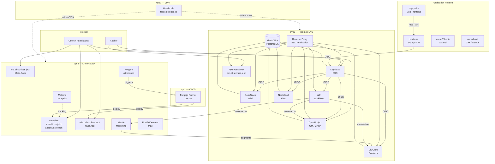
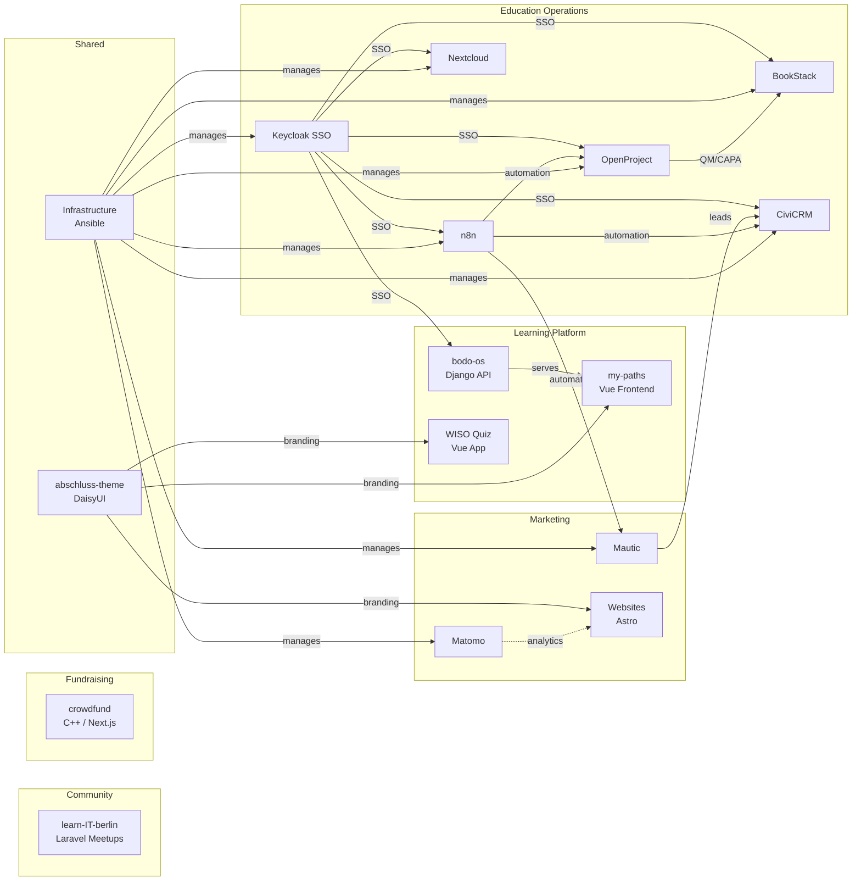

# Technical Overview

## System Landscape

The abschluss.jetzt project runs on self-hosted infrastructure with multiple interconnected services.

### Architecture Diagram

### Server Overview

| Server | Role | Key Services |
| --- | --- | --- |
| **vps3** | LAMP stack (Apache, PHP 8.3, MariaDB) | Websites, Forgejo, Matomo, Mautic, Mail, acme-dns |
| **pve3** | Proxmox hypervisor (LXC containers) | Keycloak, BookStack, OpenProject, n8n, CiviCRM, Nextcloud, QM site |
| **vps1** | CI/CD executor | Forgejo Actions Runner (Docker) |
| **vps2** | VPN coordination | Headscale (Tailscale-compatible) |

All servers connected via Headscale VPN for administration. Wildcard SSL `*.abschluss.jetzt` via acme-dns on vps3.

## Tech Stack per Project

| Project | Backend | Frontend | Database | Deployment |
| --- | --- | --- | --- | --- |
| **Infrastructure** | Ansible 2.x | — | — | VPS + Proxmox |
| **bodo-os** | Django 5.2 + DRF 3.16 | — | PostgreSQL | TBD |
| **my-paths** | — | Vue 3 + RxDB | IndexedDB (local) | TBD |
| **learn-IT-berlin** | Laravel 12 + Livewire | Tailwind + DaisyUI | MySQL | Laravel Cloud |
| **crowdfund** | C++17 Drogon 1.9 | Next.js 16 | PostgreSQL + Redis | Docker |
| **website** | — | Astro + Tailwind v4 | — | VPS (static rsync) |
| **multiple-choice-app** | — | Vue 3 + Vite + DaisyUI | — | Forgejo Actions → rsync |
| **@abschluss/theme** | — | DaisyUI theme (CSS) | — | npm local package |

## How Projects Interconnect

### Integration Points

- **Keycloak** provides SSO across all services (OIDC). Groups control access (see [access control](../qm/zugangskontrolle.md)).
- **bodo-os** (Django) serves the REST API for learning paths; **my-paths** (Vue) is its offline-capable frontend.
- **@abschluss/theme** provides consistent branding (DaisyUI light/dark) to all Vue/Astro frontends.
- **learn-IT-berlin** is a standalone event/meetup app for the Berlin community.
- **crowdfund** is a standalone non-profit crowdfunding platform.
- **Mautic** handles marketing automation; leads convert to **CiviCRM** contacts via **n8n** workflows.
- **OpenProject** manages QM processes, CAPA tracking, and AZAV certification milestones.
- **BookStack** serves as the internal knowledge base / wiki for procedures and learning materials.
- All servers managed via **Ansible** playbooks (infrastructure-as-code). See [CI/CD](ci-cd.md) for deployment patterns.

## Key Architectural Decisions

All major decisions are documented as ADRs — see [adrs.md](adrs.md) for the full list.

## Sources

- `../../infrastructure/docs/architecture.md` — Server topology and network diagrams
- `../../infrastructure/docs/education-platform.md` — Platform component overview
- `../../infrastructure/docs/index.md` — Service directory
