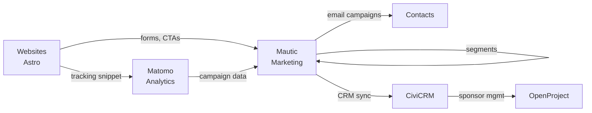

# Websites & Communication Stack

## Websites

### Public Sites

| Domain | Stack | Purpose | Source |
| --- | --- | --- | --- |
| **abschluss.jetzt** | Astro, Tailwind CSS v4 | Main website, landing page (DE) | `../website/abschluss.jetzt/` |
| **abschluss.coach** | Astro, Tailwind CSS v4 | Coaching landing page | `../website/abschluss.coach/` |
| **wiso.abschluss.jetzt** | Vue 3, Vite, DaisyUI | Multiple-choice quiz app | `../multiple-choice-app/` |

All static sites are built locally and deployed via rsync to Apache on VPS3 (wildcard SSL via `*.abschluss.jetzt`).

### Internal Sites

| Domain | Stack | Purpose |
| --- | --- | --- |
| **info.abschluss.jetzt** | mkdocs-material | This meta-documentation (Basic Auth) |
| **infra.abschluss.jetzt** | mkdocs-material | Infrastructure documentation |
| **qm.abschluss.jetzt** | TBD | QM handbook for AZAV certification |

### Shared Theme

All frontend projects use `@abschluss/theme` — a DaisyUI theme with light/dark mode, shared color system, and self-hosted fonts (Inter, JetBrains Mono). See [CI/CD](ci-cd.md) for package details.

### Technology Choices

- **Astro:** Static-site generator with island architecture — fast, SEO-friendly, zero JS by default
- **Tailwind CSS v4:** Utility-first CSS via Vite plugin (no PostCSS config needed)
- **DaisyUI:** Component library on top of Tailwind — consistent theming across apps
- **mkdocs-material:** Documentation sites with search, navigation, Mermaid diagrams

## Marketing Automation: Mautic

Self-hosted [Mautic](https://www.mautic.org/) instance for email marketing and lead management.

### Capabilities

- **Contact management:** Segmentation, tagging, lead scoring
- **Email campaigns:** Newsletter, drip campaigns, transactional emails
- **Landing pages:** Built-in landing page builder with forms
- **Tracking:** Website visitor tracking via JavaScript snippet
- **Automation:** Visual campaign builder with triggers, decisions, actions

### Cron Jobs (automated)

| Job | Interval | Purpose |
| --- | --- | --- |
| `segments:update` | 5 min | Recalculate contact segments |
| `campaigns:trigger` | 5 min | Execute campaign actions |
| `emails:send` | 15 min | Process email queue |
| `import` | 15 min | Process CSV/API imports |
| `webhooks:process` | 15 min | Handle incoming webhooks |
| `reports:scheduler` | hourly | Generate scheduled reports |

### Infrastructure

- Deployed via Ansible role `mautic` on VPS3
- MariaDB backend (utf8mb4)
- Apache + PHP-FPM, Let's Encrypt SSL
- SMTP via Postfix (same server)

See `../infrastructure/roles/mautic/`

## Web Analytics: Matomo

Self-hosted [Matomo](https://matomo.org/) for privacy-respecting web analytics.

### Why Matomo

- **DSGVO-konform:** No data transfer to third parties, all data on German servers
- **No consent banner needed** (when configured without cookies)
- **Full data ownership:** Raw data accessible, no sampling
- **Open source:** Community edition, self-hosted

### Features in Use

- Page views, referrers, search terms
- Goal tracking (e.g. form submissions, sign-ups)
- Campaign URL tracking (UTM parameters)
- Heatmaps and session recordings (optional)
- API access for custom dashboards

### Infrastructure

- Deployed via Ansible role `matomo` on VPS3
- Auto-updates from builds.matomo.org
- Archive cron every 30 minutes
- MariaDB backend

See `../infrastructure/roles/matomo/`

## Communication Channels

| Channel | Tool | Purpose |
| --- | --- | --- |
| **Chat** | Matrix (self-hosted) | Internal team communication |
| **Email** | Postfix + Dovecot (VPS3) | Transactional + organizational email |
| **Newsletter** | Mautic | Marketing emails, campaign automation |
| **CRM** | CiviCRM (on Nextcloud) | Contact management for sponsors, partners |
| **Project Management** | OpenProject | Task tracking, Gantt, QM processes |

## Integration Flow

## Sources

- `../website/abschluss.jetzt/astro.config.mjs` — Main website config
- `../website/abschluss.coach/astro.config.mjs` — Coaching site config
- `../infrastructure/roles/mautic/` — Marketing automation setup
- `../infrastructure/roles/matomo/` — Analytics setup
- `../packages/theme-abschluss/` — Shared DaisyUI theme
