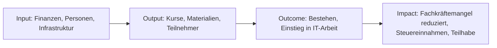

# Wirkungsbericht 2026

> **Status: In Arbeit.** Aufbau-Jahr der Organisation. Dieser Bericht wird laufend aktualisiert und zum Jahresende 2026 / Anfang 2027 finalisiert. Einige Abschnitte enthalten Platzhalter und Planwerte, die bis Jahresende durch Ist-Daten ersetzt werden.

---

## 1. Vorwort

(Wird zum Jahresende 2026 verfasst.)

2026 ist das Aufbau-Jahr von abschluss.jetzt. Dieser erste Wirkungsbericht dokumentiert Gründung, erste Kurse, den Aufbau der Infrastruktur und die Weichenstellungen für die kommenden Jahre -- ehrlich, mit dem Wissen, dass vieles im ersten Jahr noch nicht perfekt ist und viele Zahlen eher Ausblicke als Bilanzen sind.

---

## 2. Gegenstand des Berichts

| Angabe | Wert |
| --- | --- |
| Berichtszeitraum | 01.01.2026 -- 31.12.2026 |
| Berichts-Umfang | Gesamte Organisation (abschluss.jetzt gUG) |
| Anwendung SRS | Vereinfachte Form für kleine Organisationen (Erstbericht) |
| Berichtszyklus | Jährlich |
| Kontakt für Rückfragen | *(zu ergänzen)* |
| Vorheriger Bericht | Erstbericht |

---

## 3. Das gesellschaftliche Problem und unser Lösungsansatz

### 3.1 Problem

- IHK-Prüfungen für Fachinformatiker haben eine erhebliche Durchfallquote
- Berufsschulen lehren breit, aber nicht prüfungsbezogen
- Extern-Prüflinge, Quereinsteiger und Umschüler stehen oft ohne strukturierte Vorbereitung da
- Gute Prüfungsvorbereitung ist entweder teuer oder kaum verfügbar
- Deutschland hat einen anhaltenden Fachkräftemangel im IT-Bereich

### 3.2 Zielgruppen

| Zielgruppe | Spezifisches Zugangshindernis |
| --- | --- |
| Azubis | Berufsschule lehrt breit, nicht prüfungsbezogen |
| Umschüler | Hoher Druck, heterogenes Vorwissen |
| Extern-Prüflinge / Quereinsteiger | Kein institutioneller Rahmen |
| Ausländische Fachkräfte | Abschluss nicht anerkannt, Sprachbarrieren |
| Menschen mit Behinderung | Zugangsbarrieren zu Präsenz-Angeboten |

### 3.3 Lösungsansatz

- Kostenfreie, prüfungsgezielte IHK-FIAE/FISI-Vorbereitung
- Remote-first und asynchron, bundesweit zugänglich
- Open Source & Creative Commons -- auch andere Träger dürfen nutzen
- Stipendien für Teilnehmer ohne Fördermittelzugang
- Alumni-Mentoring als Reziprozitäts-Modell

### 3.4 Wirkungslogik (Theory of Change)

---

## 4. Ressourcen, Leistungen und Wirkung

### 4.1 Input -- was wurde eingesetzt?

| Kategorie | 2026 (vorläufig/geplant) |
| --- | --- |
| Finanzmittel gesamt | *(zu ergänzen)* |
| Hauptamtliches Personal (FTE) | Aufbau-Jahr, überwiegend Gründer |
| Honorar-Dozenten | *(zu ergänzen)* |
| Ehrenamtliche Stunden | *(zu ergänzen)* |
| Infrastruktur | Eigene Server (Proxmox), Domains, Open-Source-Stack |

### 4.2 Output -- was wurde gemacht?

| Leistung | 2026 (vorläufig) |
| --- | --- |
| Angebotene Kurse | *(zu ergänzen)* |
| Teilnehmer gesamt | *(zu ergänzen)* |
| davon Stipendiaten | *(zu ergänzen)* |
| Erstellte Lernmaterialien | Prüfungsaufgaben-Sammlung, Musterlösungen, Lernpfade |

### 4.3 Outcome -- direkte Wirkung

| Indikator | Ziel | 2026 Ist |
| --- | --- | --- |
| IHK-Bestehensquote | > 90 % | *(erste Kohorte schließt 2026 ab)* |
| Beschäftigungsquote 6 Monate nach Prüfung | > 80 % | *(erste Messung 2027)* |
| Teilnehmer-Zufriedenheit | > 4,0 / 5,0 | *(zu ergänzen)* |
| Alumni-Rücklauf | > 30 % | *(Messung ab 2027)* |

### 4.4 Impact -- langfristige gesellschaftliche Wirkung

**Modellrechnung (aus [wirkung-und-nachhaltigkeit.md](../../wirkung-und-nachhaltigkeit.md))**

- **SROI-Ratio (konservativ):** 8 : 1 -- Jeder investierte Euro spart der Gesellschaft 8 EUR an Folgekosten
- **Kostenvergleich:**
  - Durchfallen / Abbruch: 29.000--36.500 EUR (ALG II, erneutes Schulgeld, entgangene Steuer)
  - Gezielte Prüfungsvorbereitung: ca. 1.800--3.600 EUR pro Teilnehmer
  - **Ersparnis pro Erfolg:** 25.000--33.000 EUR vermiedene Folgekosten

**Beitrag zu SDGs:**
- SDG 4 (Hochwertige Bildung), SDG 8 (Menschenwürdige Arbeit), SDG 9 (Innovation), SDG 10 (Weniger Ungleichheiten), SDG 12 (Nachhaltiger Konsum) -- Details im Anhang

### 4.5 Ökologischer Fußabdruck

| Kategorie | 2026 | Methodik |
| --- | --- | --- |
| Strom Rechenzentrum | Eigene Server auf Ökostrom-Hosting | Nachweis Anbieter *(Zertifikat einholen)* |
| Hardware (refurbished ausgegeben) | *(zu ergänzen)* | Inventar |
| CO2-Einsparung durch Refurbish (Schätzung) | je 200--400 kg pro Gerät | Bitkom-Faktoren |
| Vermiedene Pendelwege (Remote-first) | *(Schätzung via Teilnehmer-Auskunft)* | Selbstauskunft |
| Papierverbrauch | ≈ 0 (paperless) | -- |

**Methoden-Hinweis:** Im Erstbericht dominieren Schätzungen. Ab 2027 wird die Datenerhebung strukturiert.

### 4.6 Maßnahmen im Berichtsjahr

*Wird quartalsweise befüllt.*

| Zeitraum | Maßnahme | Ergebnis |
| --- | --- | --- |
| KW 14/2026 | *(z.B. Werte-Charta und Wirkungsbericht-Vorlage erstellt)* | *(siehe docs/vision/werte/)* |
| Q1 2026 | *(Q1-Maßnahmen)* | *(Ergebnis)* |
| Q2 2026 | *(...)* | *(...)* |
| Q3 2026 | *(...)* | *(...)* |
| Q4 2026 | *(...)* | *(...)* |

**Was nicht funktioniert hat:** *(zum Jahresende ehrlich eintragen)*

---

## 5. Planung und Ausblick

### 5.1 Ziele 2027

- Erste vollständige Kohorte mit messbarer Bestehensquote
- Erweiterung der Dozenten-Basis
- Aufbau des Alumni-Beirats
- AZAV-Zertifizierung *(Status prüfen)*
- Strukturierte Datenerhebung für KPIs

### 5.2 Risiken und Unsicherheiten

| Risiko | Wahrscheinlichkeit | Auswirkung | Gegenmaßnahme |
| --- | --- | --- | --- |
| Fördermittel-Unsicherheit im Aufbau-Jahr | mittel | hoch | Diversifizierung Spender, Eigenmittel |
| Zu kleine Erstkohorte für statistische Aussagen | mittel | mittel | Mehrere kleine Kohorten, qualitative Ergänzung |
| Unterschätzung Verwaltungsaufwand gUG | mittel | mittel | QM- und AZAV-Prozesse früh aufsetzen |

### 5.3 Strategische Weichenstellungen

- Übergang gUG → gGmbH perspektivisch bei Wachstum
- AZAV-Zertifizierung als Türöffner zu Umschulungsträgern
- Kooperationsmodell mit Bildungsträgern (siehe [business/docs/partner/umschulungstraeger-strategie.md])

---

## 6. Organisationsstruktur und Team

- **Rechtsform:** gemeinnützige UG (haftungsbeschränkt), perspektivisch gGmbH
- **Geschäftsführung:** Bodo Eichstädt
- **Gesellschafter:** *(zu ergänzen)*
- **Beirat:** in Gründung
- **Alumni-Beirat:** in Gründung
- **Hauptamtliche:** Gründer (2026 überwiegend Aufbau-Arbeit)
- **Honorar-Dozenten:** *(zu ergänzen)*
- **Ehrenamtliche:** *(zu ergänzen)*

---

## 7. Organisationsprofil

- **Name:** abschluss.jetzt gUG (haftungsbeschränkt)
- **Gründung:** *(zu ergänzen)*
- **Sitz:** *(zu ergänzen)*
- **Handelsregister:** *(zu ergänzen)*
- **Gemeinnützigkeits-Status:** *(zu ergänzen)*
- **Website:** abschluss.jetzt
- **Mitgliedschaften / Partnerschaften:** *(zu ergänzen)*

---

## 8. Finanzen

*Der detaillierte Finanzteil wird nach Jahresabschluss 2026 ergänzt.*

### Transparenz-Vorschau

- Einnahmen-Struktur wird nach Quellen (öffentliche Förderung / Spenden / Betriebsbeiträge / Eigenmittel) aufgeschlüsselt
- Ausgaben-Struktur nach Kategorien (Personal / Honorare / Stipendien / Infrastruktur / Verwaltung)
- Keine Gewinnausschüttung -- rechtlich ausgeschlossen durch gUG-Form

---

## 9. Anhang

### A. KPI-Dashboard

*(zum Jahresende)*

### B. SDG-Mapping

| SDG | Unser Beitrag 2026 |
| --- | --- |
| **SDG 4** Hochwertige Bildung | Aufbau kostenfreier Prüfungsvorbereitung |
| **SDG 8** Menschenwürdige Arbeit | Vorbereitung auf qualifizierte IT-Tätigkeit |
| **SDG 9** Innovation & Infrastruktur | Open-Source-Lernplattform, deutsche Infrastruktur |
| **SDG 10** Weniger Ungleichheiten | Stipendien, Remote-first, Sprachsensibilität |
| **SDG 12** Nachhaltiger Konsum | Refurbished Hardware, paperless, selbstgehostet |

### C. Liste der Sponsoren und Partner

*(nach Zustimmung)*

### D. Methodik & Quellen

- SROI-Berechnung: [docs/vision/wirkung-und-nachhaltigkeit.md](../../wirkung-und-nachhaltigkeit.md), Businessplan
- CO2-Faktoren: Bitkom, Hersteller-Angaben
- Zufriedenheits-Messung: strukturierter Fragebogen (im QM)

### E. Glossar

- **SRS** -- Social Reporting Standard
- **SROI** -- Social Return on Investment
- **FIAE** -- Fachinformatiker Anwendungsentwicklung
- **FISI** -- Fachinformatiker Systemintegration
- **AP1/AP2** -- Abschlussprüfung Teil 1/2 der IHK

---

*Dieser Bericht wird nach dem Social Reporting Standard (SRS) erstellt. Rückmeldungen willkommen.*
