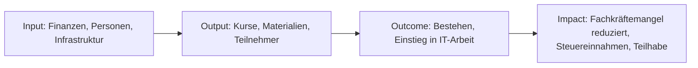

# Wirkungsbericht 2026

> **Zwischenbericht Stand KW15 / April 2026.** Finalisierung zum Jahreswechsel 2026/2027 nach Jahresabschluss.
>
> Öffentliche Werte-Präsenz: <https://abschluss.jetzt/de/werte/>

---

## 1. Vorwort

2026 ist das Aufbau-Jahr von abschluss.jetzt. Die ersten drei Monate waren Infrastruktur und Fundament — nicht Wirkung auf Teilnehmer, sondern die Voraussetzungen dafür: Website, Lernplattform, Qualitätsmanagement, Werte-Charta, ein kompletter Lead-Funnel mit DOI, Tracking und E-Mail-Automatisierung.

Warum in dieser Reihenfolge? Weil wir nicht wollen, dass die ersten Teilnehmer die "Versuchskaninchen" auf einer halbfertigen Infrastruktur sind. Das Fachinformatiker-Abschluss-Thema ist zu wichtig, um es provisorisch anzugehen. Unser Anspruch: AZAV-konform, DSGVO-konform, barriere-sensitiv und reproduzierbar von Tag 1.

Dieser Zwischenbericht dokumentiert ehrlich, was in Q1 2026 tatsächlich passiert ist, und markiert klar, was für Q2–Q4 geplant (nicht erreicht) ist. Die quantitative Wirkung auf die Zielgruppe — Bestehensquote, Beschäftigungsquote, Zufriedenheit — kann erst ab Q3/Q4 gemessen werden, wenn die ersten Kohorten die Prüfung ablegen.

Wir bleiben dabei: **Transparenz vor Präzision.** Lieber ein ehrlicher Zwischenstand als ein geschönter Hochglanz-Report.

*Bodo Eichstädt, Gründer & Geschäftsführer — Berlin, April 2026*

---

## 2. Gegenstand des Berichts

| Angabe | Wert |
| --- | --- |
| Berichtszeitraum | 01.01.2026 – 31.12.2026 (dieser Zwischenbericht: 01.01. – KW15) |
| Berichts-Umfang | Gesamte Organisation (abschluss.jetzt gUG i.Gr.) |
| Anwendung SRS | Vereinfachte Form für kleine Organisationen (Erstbericht) |
| Berichtszyklus | Jährlich, mit Zwischenbericht im Frühjahr |
| Kontakt für Rückfragen | hello@abschluss.jetzt · 0151 6341 8866 |
| Vorheriger Bericht | Erstbericht |

---

## 3. Das gesellschaftliche Problem und unser Lösungsansatz

### 3.1 Problem

- In Deutschland fallen jährlich 2.000–4.000 Fachinformatiker-Prüflinge durch die IHK-Prüfung
- Bei Umschülern liegt die Durchfallquote bei 20–30 %
- Extern-Prüflinge, Quereinsteiger und Umschüler stehen oft ohne strukturierte Vorbereitung da
- Berufsschulen lehren breit, aber nicht prüfungsbezogen
- Gute Prüfungsvorbereitung ist entweder teuer oder kaum verfügbar
- Durchfall kostet die Gesellschaft 29.000–36.500 € pro Fall (Bürgergeld, erneutes Schulgeld, entgangene Steuer)
- Deutschland hat anhaltenden Fachkräftemangel im IT-Bereich

### 3.2 Zielgruppen

| Zielgruppe | Spezifisches Zugangshindernis |
| --- | --- |
| Azubis | Berufsschule lehrt breit, nicht prüfungsbezogen |
| Umschüler | Hoher Druck, heterogenes Vorwissen |
| Extern-Prüflinge / Quereinsteiger | Kein institutioneller Rahmen |
| Ausländische Fachkräfte | Abschluss nicht anerkannt, Sprachbarrieren |
| Menschen mit Behinderung | Zugangsbarrieren zu Präsenz-Angeboten |

### 3.3 Lösungsansatz

- Kostenfreie, prüfungsgezielte IHK-FIAE/FISI-Vorbereitung
- Remote-first und asynchron, bundesweit zugänglich
- Open Source & Creative Commons — auch andere Träger dürfen nutzen
- Stipendien für Teilnehmer ohne Fördermittelzugang
- Alumni-Mentoring als Reziprozitäts-Modell

### 3.4 Wirkungslogik (Theory of Change)

---

## 4. Ressourcen, Leistungen und Wirkung

### 4.1 Input — was wurde eingesetzt (Q1 2026)

| Kategorie | Q1 2026 (vorläufig) |
| --- | --- |
| Gründer-Zeit | ca. 60 % Teilzeit — entspricht ca. 400–500 Stunden |
| Finanzmittel gesamt | ca. 2.500 € Eigenmittel eingesetzt |
| davon Infrastruktur (VPS3, Domains, Lizenzen) | ca. 500 € |
| davon Software-Lizenzen (JetBrains via Non-Profit-Programm) | 0 € (in-kind) |
| davon Fachliteratur & IHK-Material | ca. 300 € |
| Ehrenamtliche Stunden (Peer-Review, Probelesen) | ca. 40 h |
| Hauptamtliches Personal | noch nicht, Gründer-Phase |

Mittelfluss im Gesamtjahr wird nach Jahresabschluss in Abschnitt 8 ausgewiesen.

### 4.2 Output — was wurde gemacht (Q1 2026)

**Abgeschlossen in Q1:**

- **Website live** — [abschluss.jetzt](https://abschluss.jetzt) (Astro, zweisprachig DE/EN, DSGVO-konform self-hosted)
- **Lead-Funnel live** — 3 Entry-Pfade (Projekt, Prüfung, Allgemein) mit Double-Opt-In, Tracked Downloads und Drip-Kampagnen
- **Infrastruktur aufgebaut** — Proxmox + 13 LXC-Container: Keycloak SSO, Mautic, CiviCRM, n8n, Matomo, Nextcloud, OpenProject, BookStack
- **QM-Handbuch** — 45 Dokumente in 9 Kapiteln (AZAV-vorbereitet), auf qm.abschluss.jetzt veröffentlicht
- **Design-Foundation** — zentrales `ci/`-Verzeichnis mit Design-Tokens, automatisch generiert für Astro, Typst (eBooks), Reveal-Präsentation und Mautic-Theme
- **Werte-Charta publiziert** — 7 Dokumente in [docs/vision/werte/](https://github.com/bodo/code-community/tree/main/docs/vision/werte) mit ESG-Struktur, Gendern-Passus, Präambel-Textbaustein
- **3 eBooks** — "7 häufigste Fehler", "Projektarbeit meistern", "AP2 Countdown" als kostenlose Lead-Magneten
- **Test-Infrastruktur** — 112 automatisierte Tests (Vitest, Playwright, PHPUnit) über Frontend und Backend
- **Erste Beratungsgespräche** — mit Extern-Prüflingen und einer Ukrainehilfe-Organisation über Vermittlung ausländischer IT-Fachkräfte

**Kennzahlen Q1:**

| Leistung | Q1 2026 (Ist) |
| --- | --- |
| Angebotene Kurse | 0 (Aufbau-Phase) |
| Registrierte Kontakte in Mautic (Stand KW15) | 1.638 |
| Newsletter-Abonnenten | laufend aufbauend |
| Website-Besuche (Matomo) | dokumentiert, Auswertung im Jahresbericht |
| eBook-Downloads | getrackt, Auswertung im Jahresbericht |

### 4.3 Outcome — direkte Wirkung

Wirkungs-Messung beginnt mit der ersten Kohorte im Sommer 2026. Erste Messwerte frühestens Q3 2026.

| Indikator | Zielgröße | Q1 2026 Ist |
| --- | --- | --- |
| IHK-Bestehensquote | > 90 % | (erste Kohorte Q3 2026) |
| Beschäftigungsquote 6 Monate nach Prüfung | > 80 % | (erste Messung Q1 2027) |
| Teilnehmer-Zufriedenheit (1–5) | > 4,0 | (laufende Erfassung ab Q2 2026) |
| Alumni-Rücklauf | > 30 % aktiv | (Messung ab 2027) |

### 4.4 Impact — langfristige gesellschaftliche Wirkung

**Modellrechnung basierend auf [wirkung-und-zahlen.md](../wirkung-und-zahlen.md) und `bpw/businessplan.typ` (Kap. 7.5):**

- **SROI konservativ: 8 : 1** — jeder investierte Euro spart der Gesellschaft 8 € an Folgekosten
- **Brutto-SROI (ohne Korrekturen):** 16:1 bis 122:1
- **Worst-Case (bei nur 70 % Bestehensquote):** weiterhin 5:1
- **Kostenvergleich:**
  - Durchfallen / Abbruch: 29.000–36.500 € Folgekosten pro Fall
  - Gezielte Prüfungsvorbereitung: 1.800–3.600 € pro Teilnehmer
  - **Ersparnis pro erfolgreichem Teilnehmer: 25.000–33.000 €**

**SDG-Beitrag:** SDG 4 (Hochwertige Bildung), SDG 8 (Menschenwürdige Arbeit), SDG 9 (Innovation), SDG 10 (Weniger Ungleichheiten), SDG 12 (Nachhaltiger Konsum). Details siehe Anhang und [wirkung-und-zahlen.md](../wirkung-und-zahlen.md).

### 4.5 Ökologischer Fußabdruck (Stand KW15/2026)

| Kategorie | Q1 2026 | Methodik / Anmerkung |
| --- | --- | --- |
| Strom Rechenzentrum (Hosting) | ca. 100 kWh (Schätzung) | Ökostrom-Nachweis vom Hosting-Partner einholen — **offen, Ziel Q2** |
| Hardware (Neubeschaffung) | 0 | bewusst keine Neubeschaffung |
| Hardware (refurbished) | 0 ausgegeben (Kurse noch nicht gestartet) | Refurbish-Laptops als Leih-Hardware sind vorbereitet |
| CO2-Einsparung-Potenzial | 20–40 t bei 100 Refurbish-Geräten | Bitkom-Faktoren, Schätzung |
| Vermiedene Pendelwege | n.a. (noch keine Präsenztermine) | Remote-first per Design |
| Papierverbrauch | ≈ 0 | papierlos per Design |

**Methoden-Hinweis:** Im Erstbericht dominieren Schätzungen. Ab 2027 wird die Datenerhebung strukturiert (KPI-Dashboard im QM).

### 4.6 Maßnahmen im Berichtsjahr

| Zeitraum | Maßnahme | Status |
| --- | --- | --- |
| **Q1 2026 (Ist)** | Website abschluss.jetzt live (Astro, zweisprachig) | ✅ |
| **Q1 2026 (Ist)** | Lead-Funnel mit DOI und Tracked Downloads | ✅ |
| **Q1 2026 (Ist)** | Infrastruktur-Setup (13 LXC, Mautic, Keycloak, CiviCRM) | ✅ |
| **Q1 2026 (Ist)** | QM-Handbuch (45 Dokumente, qm.abschluss.jetzt) | ✅ |
| **Q1 2026 (Ist)** | CI-Foundation mit Design-Tokens | ✅ |
| **Q1 2026 (Ist)** | Werte-Charta (7 Dokumente) publiziert | ✅ |
| **Q1 2026 (Ist)** | 3 eBooks als Lead-Magneten | ✅ |
| **Q1 2026 (Ist)** | Test-Infrastruktur (112 Tests) aufgesetzt | ✅ |
| **Q1 2026 (Ist)** | Hackerspace-Vortrag mit Ukrainehilfe-Vertretern | ✅ |
| **Q2 2026 (Plan)** | Freiberufler-Anmeldung, erste bezahlte Coaching-Gespräche | geplant |
| **Q2 2026 (Plan)** | BPW-Wettbewerb Teilnahme | geplant |
| **Q2 2026 (Plan)** | Mail-Kampagnen für AP1/AP2-Prüfungsvorbereitung | geplant |
| **Q2/Q3 2026 (Plan)** | gUG-Gründung (Notar, Gemeinnützigkeitsantrag) | geplant |
| **Q3 2026 (Plan)** | YouTube- und Google-Ads-Kampagnen (Google Ad Grants) | geplant |
| **Q3/Q4 2026 (Plan)** | AZAV-Antrag: Trägerzulassung + Maßnahmenzulassungen | geplant |
| **Q4 2026 (Plan)** | Externes AZAV-Audit (Incession), Zertifizierung | geplant |
| **ab 2027 (Plan)** | Erste Bildungsgutscheine (AVGS/FBW) abrechenbar | geplant |

**Was nicht funktioniert hat / Lessons Learned aus Q1:**

- *Werden zum Jahreswechsel ehrlich ergänzt.* Erste Beobachtung: das Tempo der Infrastruktur-Aufbau-Arbeit ist hoch; Priorisierung zwischen Content (eBooks, Kurse) und Technik (Tests, CI) braucht Disziplin.

---

## 5. Planung und Ausblick

### 5.1 Ziele 2027

- **Erste vollständige Kohorte** mit messbarer Bestehensquote (Ziel: > 90 %)
- **AZAV-Zertifizierung abgeschlossen** — Bildungsgutscheine (AVGS/FBW) werden abrechenbar
- **20+ Teilnehmer** aktiv betreut
- **Break-Even** bei laufenden Kosten in Q2/Q3 2027
- **Alumni-Mentoring** aufgesetzt, erste ehemalige Teilnehmer als Mentoren aktiv
- **Strukturierte Datenerhebung** für alle KPIs

### 5.2 Risiken und Unsicherheiten

| Risiko | Wahrscheinlichkeit | Auswirkung | Gegenmaßnahme |
| --- | --- | --- | --- |
| AZAV-Zertifizierung verzögert sich | mittel | hoch (Bildungsgutscheine erst später möglich) | Frühzeitiger QM-Aufbau (Q1 erledigt); alternative Einnahmen über Direktvertrieb |
| Fördermittel-Unsicherheit | mittel | mittel | Diversifizierung (3 Säulen: Direktvertrieb, Bildungsgutscheine, Spenden) |
| Zu kleine Erstkohorte für statistische Aussagen | mittel | mittel | Mehrere kleine Kohorten, qualitative Ergänzung |
| Wettbewerber im AZAV-Markt | gering | mittel | Differenzierung über Qualität, Gemeinnützigkeit, Open Source |

### 5.3 Strategische Weichenstellungen

- Übergang gUG → gGmbH perspektivisch bei Wachstum
- AZAV-Zertifizierung als Türöffner zu Umschulungsträgern und JobCenter
- Kooperationsmodell mit Bildungsträgern (Umschulungsträger als Partner, nicht Konkurrenten)
- Ukrainehilfe und Migrations-Beratungsstellen als Vermittlungspartner für ausländische IT-Fachkräfte

---

## 6. Organisationsstruktur und Team

| Rolle | Besetzung | Stand |
| --- | --- | --- |
| Gründer, Geschäftsführer | Bodo Eichstädt | aktiv seit Q1 2026 |
| Gesellschafter | Bodo Eichstädt (Stammkapital 2.000 €) | einzig, Ausweitung geplant |
| Beirat | — | in Gründung |
| Alumni-Beirat | — | in Gründung (nach erster Kohorte 2026/27) |
| Hauptamtliche | — | Gründer-Phase, ~60 % Teilzeit |
| Honorar-Dozenten | — | erste Anfragen laufen (Ukrainehilfe-Kontakte, pädagogische Begleiter) |
| Ehrenamtliche | ca. 2–3 Personen für Peer-Review, Probelesen | informell |

Bodo bringt 25 Jahre Softwareentwicklungs-Erfahrung, Community-Building und Lehrtätigkeit mit. 2025/2026 selbst Extern-Prüfling für den IHK-Abschluss Fachinformatiker AE.

---

## 7. Organisationsprofil

| Angabe | Wert |
| --- | --- |
| Name | abschluss.jetzt gUG (haftungsbeschränkt, in Gründung) |
| Geplante Rechtsform | gemeinnützige UG, perspektivisch gGmbH |
| Gründung | geplant Q2/Q3 2026 (Notar + Handelsregister) |
| Sitz | Berlin |
| Handelsregister | noch nicht eingetragen |
| Gemeinnützigkeits-Status | Antrag in Vorbereitung |
| Website | [abschluss.jetzt](https://abschluss.jetzt) |
| Kontakt | hello@abschluss.jetzt · 0151 6341 8866 |
| Mitgliedschaften / Partnerschaften | VR-Nutzergemeinschaft (Hackerspace), informelle Kooperationen mit Ukrainehilfe, JetBrains (Non-Profit-Programm) |

---

## 8. Finanzen

*Der detaillierte Finanzteil wird nach Jahresabschluss 2026 / Anfang 2027 ergänzt.*

### Q1 2026 Mittelfluss (Schätzung)

| Position | Q1 2026 (€) |
| --- | --- |
| Eigenmittel eingesetzt | ca. 2.500 |
| Infrastruktur (Server, Domains, Lizenzen) | ca. 500 |
| Fachliteratur & Prüfungsmaterial | ca. 300 |
| Software-Lizenzen (in-kind via JetBrains Non-Profit) | 0 |
| Rücklagen | verbleibend |

### Transparenz-Vorschau Gesamtjahr

- **Einnahmen** werden nach Quellen strukturiert (öffentliche Förderung / Spenden / Betriebsbeiträge / Eigenmittel)
- **Ausgaben** nach Kategorien (Personal / Honorare / Stipendien / Infrastruktur / Verwaltung)
- **Keine Gewinnausschüttung** — rechtlich ausgeschlossen durch gUG-Form
- **Gründungszuschuss** (14.400 €) ist nach Konzeptprüfung in Aussicht gestellt

---

## 9. Anhang

### A. KPI-Dashboard

*Strukturierte Erfassung ab Q2 2026. Erste Vollausfüllung im Jahresbericht 2026 Anfang 2027.*

### B. SDG-Mapping

| SDG | Unser Beitrag 2026 (Stand KW15) |
| --- | --- |
| **SDG 4 Hochwertige Bildung** | Aufbau kostenfreier Prüfungsvorbereitung; Werte-Charta publiziert; eBooks als Open-Content |
| **SDG 8 Menschenwürdige Arbeit** | Vorbereitung auf qualifizierte IT-Tätigkeit — erste Beratungen gestartet |
| **SDG 9 Innovation & Infrastruktur** | Open-Source-Lernplattform, deutsche Infrastruktur, self-hosted |
| **SDG 10 Weniger Ungleichheiten** | Stipendien-Konzept, Remote-first, Sprachsensibilität; Gespräche mit Ukrainehilfe-Vertretern |
| **SDG 12 Nachhaltiger Konsum** | Refurbished Hardware (vorbereitet), paperless, self-hosted statt Hyperscaler |

### C. Liste der Sponsoren und Partner

*(Erstkohorte läuft, detaillierte Liste nach Zustimmung der Partner im Jahresbericht)*

- **Technologie-Partnerschaft:** JetBrains (Non-Profit-Lizenzen, in-kind)
- **Hackerspace:** VR-Nutzergemeinschaft Berlin (Raum-Nutzung in Prüfungsmonaten)

### D. Methodik & Quellen

- **SROI-Berechnung:** [wirkung-und-zahlen.md](../wirkung-und-zahlen.md); Detail in `bpw/businessplan.typ` (intern)
- **CO2-Faktoren:** Bitkom, Hersteller-Angaben, Ökostrom-Zertifikate
- **Zufriedenheits-Messung:** strukturierter Fragebogen (im QM-Handbuch dokumentiert)
- **SRS Social Reporting Standard:** <https://www.social-reporting-standard.de/>

### E. Glossar

- **SRS** — Social Reporting Standard
- **SROI** — Social Return on Investment
- **FIAE** — Fachinformatiker Anwendungsentwicklung
- **FISI** — Fachinformatiker Systemintegration
- **AP1/AP2** — Abschlussprüfung Teil 1/2 der IHK
- **AZAV** — Akkreditierungs- und Zulassungsverordnung Arbeitsförderung (Voraussetzung für Bildungsgutscheine)
- **AVGS / FBW** — Aktivierungs- und Vermittlungsgutschein / Förderung der beruflichen Weiterbildung
- **B-DKS** — Bundesdurchschnittskostensatz (Kostensätze der Bundesagentur für Arbeit)
- **gUG / gGmbH** — gemeinnützige Unternehmergesellschaft / gemeinnützige GmbH

---

*Dieser Bericht folgt dem [Social Reporting Standard (SRS)](https://www.social-reporting-standard.de/). Rückmeldungen willkommen: hello@abschluss.jetzt*

*Öffentliche Werte-Präsenz: <https://abschluss.jetzt/de/werte/>*
