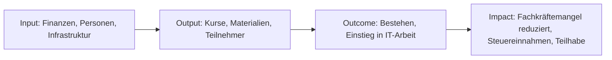

# Wirkungsbericht {{JAHR}}

> **Vorlage nach Social Reporting Standard (SRS).** Für ein neues Berichtsjahr: diese Datei nach `{{JAHR}}.md` kopieren und Platzhalter befüllen. Kommentare `<!-- ... -->` geben Hinweise, welche Quellen zu nutzen sind, und werden vor Veröffentlichung entfernt.

---

## 1. Vorwort

<!--
Ca. 1 Seite, persönlich, von der Geschäftsführung. Worum geht es?
- Was war das prägende Thema des Jahres?
- Ein bis zwei konkrete Erfolge / Momente
- Was war schwierig? (Ehrlichkeit schlägt Schönfärberei)
- Dank an Unterstützer
Datum, Ort, Unterschrift.
-->

(Platzhalter: Vorwort der Geschäftsführung.)

---

## 2. Gegenstand des Berichts

| Angabe | Wert |
| --- | --- |
| Berichtszeitraum | 01.01.{{JAHR}} -- 31.12.{{JAHR}} |
| Berichts-Umfang | Gesamte Organisation (abschluss.jetzt gUG) |
| Anwendung SRS | Vereinfachte Form für kleine Organisationen |
| Berichtszyklus | Jährlich |
| Kontakt für Rückfragen | {{KONTAKT_EMAIL}} |
| Vorheriger Bericht | {{LINK_VORHERIGER_BERICHT_ODER_"Erstbericht"}} |

---

## 3. Das gesellschaftliche Problem und unser Lösungsansatz

### 3.1 Problem

<!--
Quellen: docs/vision/uebersicht.md ("Das Problem") +
docs/vision/rollen-und-zielgruppen.md +
aktuelle Daten zu Fachkräftemangel, IHK-Durchfallquoten
-->

- IHK-Prüfungen für Fachinformatiker haben eine erhebliche Durchfallquote
- Berufsschulen lehren breit, aber nicht prüfungsbezogen
- Extern-Prüflinge, Quereinsteiger, Umschüler stehen oft allein da
- Gute Prüfungsvorbereitung ist häufig teuer oder kaum verfügbar
- Fachkräftemangel IT in Deutschland: {{AKTUELLE_ZAHL}}

### 3.2 Zielgruppen

<!-- Quelle: docs/vision/rollen-und-zielgruppen.md und docs/vision/werte/soziale-verantwortung.md -->

| Zielgruppe | Spezifisches Zugangshindernis |
| --- | --- |
| Azubis | Berufsschule lehrt breit, nicht prüfungsbezogen |
| Umschüler | Hoher Druck, heterogenes Vorwissen |
| Extern-Prüflinge / Quereinsteiger | Kein institutioneller Rahmen |
| Ausländische Fachkräfte | Abschluss nicht anerkannt, Sprachbarrieren |
| Menschen mit Behinderung | Zugangsbarrieren zu Präsenz |

### 3.3 Lösungsansatz

- **Kostenfreie, prüfungsgezielte Vorbereitung** auf IHK-FIAE/FISI
- **Remote-first, asynchron** -- bundesweit zugänglich
- **Open Source & Creative Commons** -- auch andere Träger können nutzen
- **Stipendien** für Teilnehmer ohne Fördermittelzugang
- **Alumni-Mentoring** -- Reziprozität und Community-Aufbau

### 3.4 Wirkungslogik (Theory of Change)

---

## 4. Ressourcen, Leistungen und Wirkung

### 4.1 Input -- was wurde eingesetzt?

| Kategorie | {{JAHR}} |
| --- | --- |
| Finanzmittel gesamt | {{EUR}} |
| davon öffentliche Förderung | {{EUR}} |
| davon Spenden | {{EUR}} |
| davon Betriebsbeiträge | {{EUR}} |
| davon Eigenmittel | {{EUR}} |
| Hauptamtliches Personal (FTE) | {{ZAHL}} |
| Honorar-Dozenten (Personen) | {{ZAHL}} |
| Ehrenamtliche Stunden | {{STUNDEN}} |
| Infrastruktur (Server, Lizenzen) | {{EUR}} |

### 4.2 Output -- was wurde gemacht?

| Leistung | {{JAHR}} |
| --- | --- |
| Angebotene Kurse | {{ZAHL}} |
| Teilnehmer gesamt | {{ZAHL}} |
| davon Stipendiaten | {{ZAHL}} |
| Kurs-Stunden (gelehrt) | {{ZAHL}} |
| Erstellte / aktualisierte Lernmaterialien | {{SEITEN/MODULE}} |
| Mentoring-Beziehungen | {{ZAHL}} |

### 4.3 Outcome -- was hat es direkt bewirkt?

| Indikator | Ziel | {{JAHR}} Ist |
| --- | --- | --- |
| IHK-Bestehensquote | > 90 % | {{%}} |
| Beschäftigungsquote 6 Monate nach Prüfung | > 80 % | {{%}} |
| Teilnehmer-Zufriedenheit (1--5) | > 4,0 | {{WERT}} |
| Alumni-Rücklauf (aktiv im Mentoring) | > 30 % | {{%}} |

### 4.4 Impact -- langfristige gesellschaftliche Wirkung

<!-- Quelle: docs/vision/wirkung-und-nachhaltigkeit.md -->

- **SROI-Ratio:** {{WERT}} : 1 (Ziel: ≥ 8:1) -- Jeder investierte Euro spart der Gesellschaft {{WERT}} € an Folgekosten
- **Qualifizierte Fachkräfte in den Arbeitsmarkt entlassen:** {{ZAHL}}
- **Vermiedene ALG-II-Abhängigkeit (Schätzung):** {{ZAHL}} Personen
- **Beitrag zu SDGs:** SDG 4, 8, 9, 10, 12 (Details siehe Anhang)

### 4.5 Ökologischer Fußabdruck

| Kategorie | {{JAHR}} | Methodik |
| --- | --- | --- |
| Strom Rechenzentrum (Ökostrom) | {{kWh}} | Rechnung Hosting |
| Hardware: refurbished ausgegeben | {{ZAHL}} Geräte | Inventar |
| CO2-Einsparung durch Refurbish (Schätzung) | {{TONNEN}} | Bitkom-Faktoren |
| Vermiedene Pendelwege durch Remote | {{km}} | Teilnehmer-Selbstauskunft |
| Papierverbrauch | {{kg}} | Einkauf |

**Methoden-Hinweis:** Diese Werte sind Schätzungen mit dokumentierter Unsicherheit. Präzision wächst mit jedem Berichtsjahr.

### 4.6 Maßnahmen im Berichtsjahr

<!--
Das ist das "Herzstück" eines SRS-Berichts. Konkrete Aktivitäten,
neue Angebote, Kooperationen, Meilensteine, Lehren. Sortiert nach
Quartalen oder Themen. Hier darf Stolz sein - und Ehrlichkeit über
das, was nicht geklappt hat.
-->

| Monat/Quartal | Maßnahme | Ergebnis |
| --- | --- | --- |
| Q1 | {{z.B. Erster Pilot-Kurs AP1}} | {{Ergebnis}} |
| Q2 | {{z.B. Kooperation mit Umschulungsträger X}} | {{Ergebnis}} |
| Q3 | {{...}} | {{...}} |
| Q4 | {{...}} | {{...}} |

**Was nicht funktioniert hat:**
- {{Ehrliche Lessons Learned}}

---

## 5. Planung und Ausblick

### 5.1 Ziele {{JAHR+1}}

- {{Konkretes, messbares Ziel}}
- {{...}}

### 5.2 Risiken und Unsicherheiten

| Risiko | Wahrscheinlichkeit | Auswirkung | Gegenmaßnahme |
| --- | --- | --- | --- |
| {{z.B. Fördermittel-Ausfall}} | {{mittel}} | {{hoch}} | {{Diversifizierung}} |

### 5.3 Strategische Weichenstellungen

<!-- Ist eine Umwandlung zur gGmbH geplant? Neue Kursformate? AZAV? -->

---

## 6. Organisationsstruktur und Team

- **Rechtsform:** gemeinnützige UG (haftungsbeschränkt), perspektivisch gGmbH
- **Geschäftsführung:** {{NAME}}
- **Gesellschafter:** {{LISTE}}
- **Beirat:** {{LISTE oder "in Gründung"}}
- **Alumni-Beirat:** {{LISTE oder "in Gründung"}}
- **Hauptamtliche:** {{ZAHL}} ({{FTE}} FTE)
- **Honorar-Dozenten:** {{ZAHL}}
- **Ehrenamtliche:** {{ZAHL}}

---

## 7. Organisationsprofil

- **Name:** abschluss.jetzt gUG (haftungsbeschränkt)
- **Gründung:** {{DATUM}}
- **Sitz:** {{ORT}}
- **Handelsregister:** {{HRB-NR}}
- **Gemeinnützigkeits-Status:** Freistellungsbescheid vom {{DATUM}}, gültig bis {{DATUM}}
- **Website:** abschluss.jetzt
- **Kontakt:** {{EMAIL}}
- **Mitgliedschaften / Partnerschaften:** {{LISTE}}

---

## 8. Finanzen

### 8.1 Einnahmen {{JAHR}}

| Quelle | EUR | % |
| --- | --- | --- |
| Öffentliche Förderung | {{EUR}} | {} |
| Spenden (Unternehmen / Sponsoren) | {{EUR}} | {} |
| Eigenmittel / Rücklagen | {{EUR}} | {{%}} |
| **Gesamt** | **{{EUR}}** | **100 %** |

### 8.2 Ausgaben {{JAHR}}

| Kategorie | EUR | % |
| --- | --- | --- |
| Personalkosten (haupt- & nebenamtlich) | {{EUR}} | {} |
| Stipendien & Teilnehmer-Unterstützung | {{EUR}} | {} |
| Lernmaterialien | {{EUR}} | {} |
| Rücklagenbildung | {{EUR}} | {{%}} |
| **Gesamt** | **{{EUR}}** | **100 %** |

### 8.3 Besondere Hinweise zur Mittelverwendung

- Keine Gewinnausschüttung
- {{Ggf. größere Einzelposten begründen}}
- {{Ggf. Rücklagen-Begründung}}

---

## 9. Anhang

### A. KPI-Dashboard

<!-- Vollständige Kennzahlen-Tabelle aus Controlling -->

### B. SDG-Mapping

| SDG | Unser Beitrag {{JAHR}} |
| --- | --- |
| **SDG 4** Hochwertige Bildung | {{Maßnahmen, Zahlen}} |
| **SDG 8** Menschenwürdige Arbeit | {{...}} |
| **SDG 9** Innovation & Infrastruktur | {{...}} |
| **SDG 10** Weniger Ungleichheiten | {{...}} |
| **SDG 12** Nachhaltiger Konsum | {{...}} |

### C. Liste der Sponsoren und Partner

<!-- Nur mit Zustimmung namentlich, ab 500 EUR standardmäßig -->

### D. Methodik & Quellen

- SROI-Berechnung: Quelle, Formel, Annahmen
- CO2-Bilanz: Emissionsfaktoren, Datenquellen, Unsicherheitsbereich
- Zufriedenheits-Messung: Fragebogen, Rücklaufquote
- Beschäftigungsquote: Zeitpunkt, Methodik der Kontaktaufnahme

### E. Glossar

- **SRS** -- Social Reporting Standard
- **SROI** -- Social Return on Investment
- **FIAE** -- Fachinformatiker Anwendungsentwicklung
- **FISI** -- Fachinformatiker Systemintegration
- **AP1/AP2** -- Abschlussprüfung Teil 1/2 der IHK

---

*Dieser Bericht wurde nach dem Social Reporting Standard (SRS) erstellt. Rückmeldungen und Kritik sind willkommen: {{KONTAKT_EMAIL}}*
