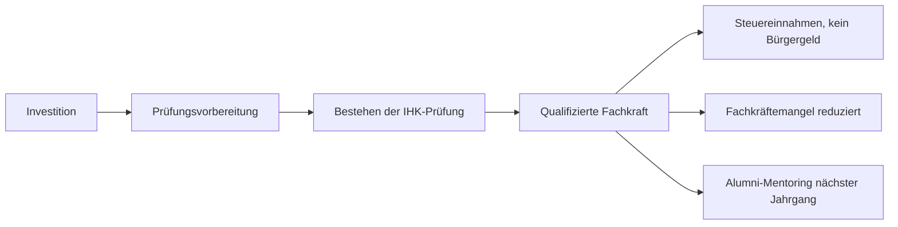

# Wirkung & Nachhaltigkeit

## Social Return on Investment (SROI)

**Konservative Berechnung: 8:1** -- Jeder investierte Euro spart der Gesellschaft 8 EUR an Folgekosten.

### Kostenvergleich

| Szenario | Kosten |
| --- | --- |
| **Durchfallen / Abbruch** | 29.000--36.500 EUR (ALG II, erneutes Schulgeld, entgangene Steuer) |
| **Gezielte Prüfungsvorbereitung** | ca. 1.800--3.600 EUR pro Teilnehmer |
| **Ersparnis pro Erfolg** | 25.000--33.000 EUR vermiedene Folgekosten |

### Wirkungskette

## UN Sustainable Development Goals (SDGs)

| SDG | Ziel | Beitrag |
| --- | --- | --- |
| **SDG 4** -- Hochwertige Bildung | 4.3, 4.4 | Gleichberechtigter Zugang zu beruflicher Bildung; Erhöhung der Jugendlichen mit arbeitsmarktrelevanten Qualifikationen |
| **SDG 8** -- Menschenwürdige Arbeit | 8.5, 8.6 | Produktive Vollbeschäftigung; Reduzierung von Jugendarbeitslosigkeit |
| **SDG 9** -- Innovation & Infrastruktur | 9.5 | Stärkung digitaler Souveränität durch qualifizierte IT-Fachkräfte |
| **SDG 10** -- Weniger Ungleichheiten | 10.2 | Soziale und wirtschaftliche Inklusion für Migranten, Quereinsteiger, Benachteiligte |
| **SDG 12** -- Nachhaltiger Konsum | 12.2 | Refurbished Hardware, Open Source, papierlose Prozesse |

## Ökologische Nachhaltigkeit

### CO2-Bilanz

| Massnahme | Einsparung |
| --- | --- |
| **100 Refurbished-Laptops** | 20--40 Tonnen CO2 vs. Neuproduktion |
| **Self-hosted statt Cloud-Hyperscaler** | Energieeffiziente eigene Server |
| **Open-Source-Software** | Kein Vendor Lock-in, kein proprietärer Overhead |
| **Papierlose Lehrmittel** | Digitale Prüfungssimulationen und Lernmaterialien |

### Prinzipien

- **Datensouveränität:** Alle Daten auf deutschen Servern, DSGVO-konform, kein Transfer an US-Clouds
- **Community-Beitrag:** Regelmässige Spenden an genutzte Open-Source-Projekte
- **Langlebigkeit:** Refurbished-Hardware verlängert Produktlebenszyklen um 3--5 Jahre
- **Transparenz:** Jährlicher Impact-Report mit messbaren Kennzahlen

## Messbare Wirkungsindikatoren

| Indikator | Messung | Ziel |
| --- | --- | --- |
| IHK-Bestehensquote | Prüfungsergebnisse pro Kohorte | > 90% |
| Beschäftigungsquote | Follow-up 6 Monate nach Prüfung | > 80% in IT-Stelle |
| Teilnehmer-Zufriedenheit | Standardisierte Evaluation | > 4.0 / 5.0 |
| CO2-Einsparung | Hardware-Tracking, Hosting-Vergleich | Dokumentiert im Impact-Report |
| Alumni-Rücklauf | Mentoring-Beteiligung, Spenden | > 30% aktiv |
| SROI-Ratio | Jährliche Berechnung | >= 8:1 |

## Quellen

- `../../bpw/businessplan.typ` -- SROI-Berechnung, SDG-Zuordnung, Nachhaltigkeitsmassnahmen
- `../../organization/presentation/index.html` -- Slides: Wirkung und Gesellschaftlicher Nutzen
